## Тема 1.5. Автоматизация версионирования в CI/CD

**Формат работы:** исследовательские практические задания с презентацией результатов.  
**Цель:** на примере проекта с Boston Housing настроить и продемонстрировать автоматическое версионирование данных и моделей в CI/CD‑пайплайне с использованием Git, DVC, Python‑скриптов и системы CI (GitHub Actions).

---

## 1. Подготовка проекта

### 1.1. Структура репозитория

- **Задача:** подготовить репозиторий для экспериментов с версионированием данных и моделей.
- **В нашем проекте** используется следующая структура:

```text
.
├── data/              # Сырые и промежуточные данные (под DVC)
├── models/            # Обученные модели и метрики (под DVC)
├── scripts/           # Скрипты обучения, валидации, оценки
├── reports/           # Отчёты и артефакты (JSON, графики)
├── config/            # Конфигурация модели
├── .dvc/              # Служебные файлы DVC
├── .github/workflows/ # CI/CD конфигурация (GitHub Actions)
├── dvc.yaml           # Описание ML‑пайплайна
├── dvc.lock           # Зафиксированное состояние пайплайна (версии данных/моделей)
├── params.yaml        # Параметры экспериментов
└── README.md
```

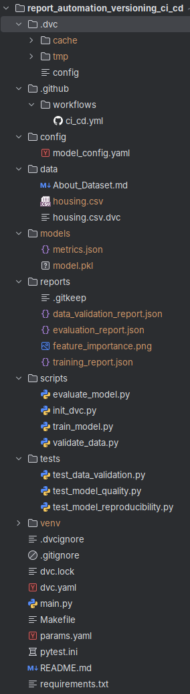

---

### 1.2. Получение датасета Boston Housing

- **Задача:** скачать и подготовить датасет.
- **В этом проекте** датасет Boston Housing сохранён в `data/housing.csv` в формате, где **разделитель — пробелы**, а заголовка в файле нет.

**Шаги, которые уже реализованы:**

1. Создан каталог `data/`.
2. Датасет сохранён в `data/housing.csv`.
3. Описание датасета вынесено в `data/About_Dataset.md` / `README.md`.

В скриптах (`scripts/validate_data.py`, `scripts/train_model.py`, `scripts/evaluate_model.py`) данные читаются так:

- `pd.read_csv("data/housing.csv", sep=r"\s+", header=None)`
- затем колонкам назначаются имена: `CRIM, ZN, INDUS, CHAS, NOX, RM, AGE, DIS, RAD, TAX, PTRATIO, B, LSTAT, MEDV`.
---

### 1.3. Инициализация Git и DVC

- **Задача:** подключить контроль версий кода (Git) и данных/моделей (DVC).

В этом проекте уже сделано:

```bash
git init
dvc init
git add .dvc .gitignore
git commit -m "Init Git and DVC"
```

Затем датасет добавлен под управление DVC:

```bash
dvc add data/housing.csv
git add data/housing.csv.dvc .gitignore
git commit -m "Add housing dataset under DVC"
dvc push
git push
```

Теперь `data/housing.csv` не хранится в Git как “толстый” файл, а управляется через `.dvc` и DVC‑remote.
---

### 1.4. Настройка удалённого репозитория и DVC‑remote

- **Задача:** разделить хранение:
  - кода и метаданных — в GitHub (репозиторий проекта),
  - данных и моделей — в DVC‑remote.

**Типовой сценарий (уже реализован/настраивается):**

1. Создан репозиторий на GitHub.
2. Привязан локальный репозиторий:
   ```bash
   git remote add origin <URL_репозитория>
   git push -u origin main
   ```
3. Настроен DVC‑remote (например, S3/GDrive/SSH):
   ```bash
   dvc remote add -d myremote <remote_url>
   dvc push
   ```

---

## 2. Создание CI/CD‑пайплайна (как в этом проекте)

### 2.1. DVC‑пайплайн, который уже описан в проекте

В этом проекте **основной ML‑пайплайн описан через `dvc.yaml`**, а не “зашит вручную” в CI.  
Файл `dvc.yaml` содержит три стадии:

- **`validate_data`**: запускает `python scripts/validate_data.py`
  - **deps**: `data/housing.csv`, `scripts/validate_data.py`
  - **outs**: `reports/data_validation_report.json`
  - **Зачем:** формализует проверку качества данных перед обучением.

- **`train_model`**: запускает `python scripts/train_model.py`
  - **deps**: `data/housing.csv`, `scripts/train_model.py`, `config/model_config.yaml`
  - **outs**: `models/model.pkl`, `models/metrics.json`, `reports/training_report.json`
  - **Зачем:** обучает модель с параметрами из конфигурации и сохраняет метрики и отчёт.

- **`evaluate_model`**: запускает `python scripts/evaluate_model.py`
  - **deps**: `models/model.pkl`, `data/housing.csv`, `scripts/evaluate_model.py`
  - **outs**: `reports/evaluation_report.json`, `reports/feature_importance.png`
  - **Зачем:** делает детальную оценку модели и сохраняет отчёт + график важности признаков.

**Важно:**  
Все зависимости и выходы в `dvc.yaml` фиксируются в `dvc.lock` — это и есть основа автоматического версионирования **данных и модели** в этом проекте.

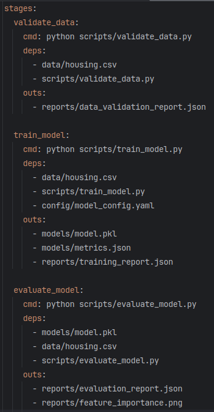

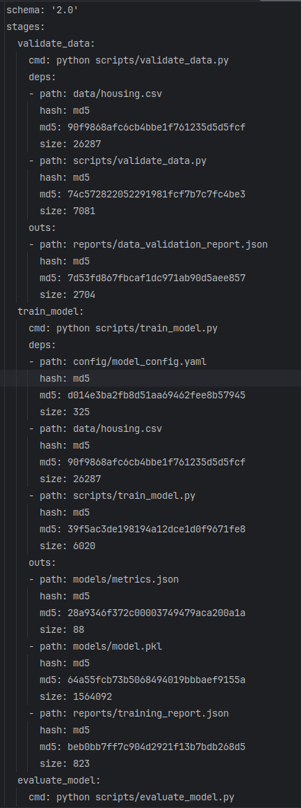

---

### 2.2. Этап проверки данных (как реализован здесь)

Проверка данных реализована через скрипт `scripts/validate_data.py`:

- читает `data/housing.csv` (Boston Housing с пробельным разделителем),
- задаёт имена колонок,
- выполняет проверки:
  - размерность (ожидается 14 колонок),
  - отсутствие пропусков,
  - все признаки — числовые,
  - диапазон целевой `MEDV` (0–50),
  - количество выбросов (через IQR),
  - количество дубликатов,
- формирует подробный JSON‑отчёт `reports/data_validation_report.json`,
- возвращает код ошибки, если критические проверки провалены.

**Как, почему и зачем:**

- **Как:** запускается как стадия `validate_data` через `dvc repro` или напрямую:
  ```bash
  python scripts/validate_data.py
  ```
- **Почему:** правила качества данных зафиксированы в одном месте, и любые отклонения видны автоматически.
- **Зачем:** чтобы в CI/CD (и локально) останавливать пайплайн на этапе “грязных” данных и не портить эксперименты.

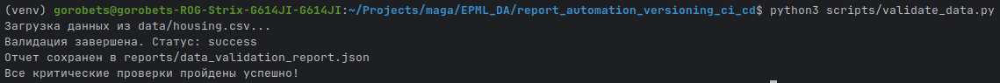

---

### 2.3. Автоматическое обучение модели (конкретная реализация)

Обучение реализовано в `scripts/train_model.py` и описано в стадии `train_model` в `dvc.yaml`.

- **Как работает скрипт:**
  - загружает конфиг из `config/model_config.yaml` / `params.yaml`,
  - загружает данные `data/housing.csv`,
  - делит их на train/test с фиксированным `random_state`,
  - обучает `RandomForestRegressor` с параметрами из конфига,
  - считает метрики (`rmse`, `mae`, `r2`),
  - сравнивает метрики с порогами (`min_r2`, `max_rmse`),
  - сохраняет:
    - модель в `models/model.pkl`,
    - метрики в `models/metrics.json`,
    - подробный отчёт в `reports/training_report.json`,
  - при нарушении порогов качества завершает работу с кодом 1.

- **Почему так:**
  - параметры обучения вынесены в конфигурацию (`params.yaml`, `config/model_config.yaml`),
  - любое изменение параметров отражается в `dvc.lock`,
  - это позволяет трактовать каждый запуск как отдельный, **чётко зафиксированный эксперимент**.

- **Зачем:**
  - чтобы каждая обученная модель была связана с конкретной версией:
    - данных (`data/housing.csv`),
    - кода (`scripts/train_model.py`),
    - параметров (`params.yaml`, `config/model_config.yaml`),
  - чтобы легко сравнивать экспериментальные версии по метрикам.

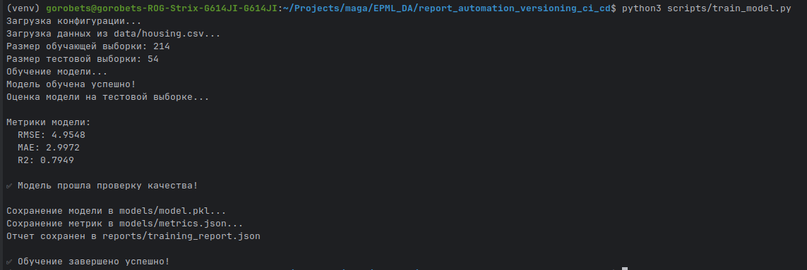

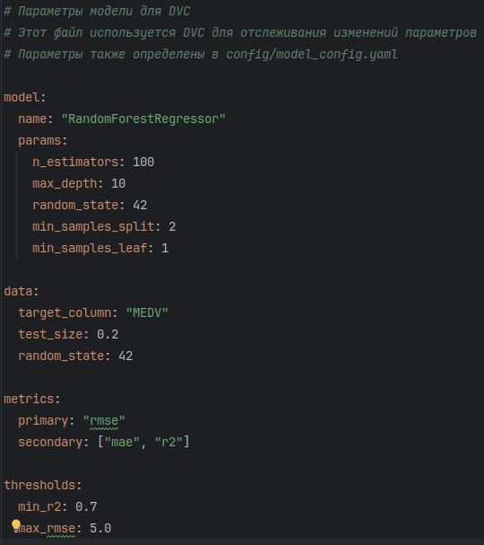

---

### 2.4. Детальная оценка модели (evaluation)

Скрипт `scripts/evaluate_model.py` выполняет дополнительную оценку уже обученной модели:

- загружает `models/model.pkl` и `data/housing.csv`,
- считает:
  - `rmse`, `mae`, `r2`,
  - MAPE,
  - статистику остатков (mean, std, min, max),
- сохраняет:
  - отчёт `reports/evaluation_report.json`,
  - график важности признаков `reports/feature_importance.png`.

**Как, почему и зачем:**

- **Как:** запускается как стадия `evaluate_model` в `dvc.yaml`.
- **Почему:** позволяет глубже понять поведение модели, а не ограничиваться одной метрикой.
- **Зачем:** для доклада удобно показывать не только цифры, но и визуализацию (feature importance).

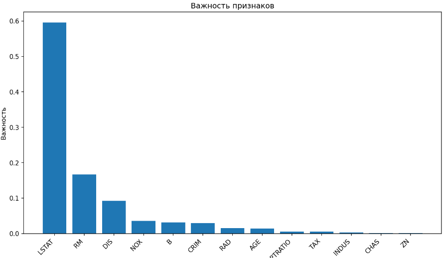


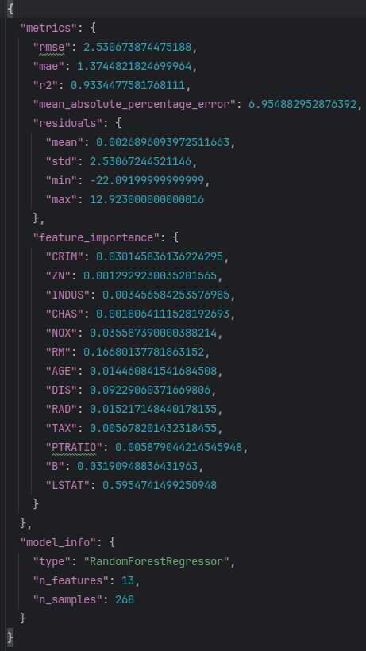

---

### 2.5. Как фиксируются версии экспериментов в этом проекте

Вся логика версионирования опирается на связку **Git + DVC + `dvc.lock`**:

- **Данные**:
  - `data/housing.csv` отслеживаются DVC через `.dvc`‑файл и `dvc.lock`,
  - конкретная версия файла хранится в DVC‑кэше/remote и “привязана” к Git‑коммиту.

- **Модели и отчёты**:
  - `models/model.pkl`, `models/metrics.json`, `reports/*.json`, `reports/feature_importance.png` описаны как `outs` в `dvc.yaml`,
  - каждый прогон `dvc repro` обновляет `dvc.lock`, фиксируя хэши всех артефактов.

- **Параметры эксперимента**:
  - лежат в `params.yaml` и `config/model_config.yaml`,
  - их изменения также отражаются в `dvc.lock`.

**Как, почему и зачем:**

- **Как:** после изменения кода/параметров и запуска `dvc repro`:
  ```bash
  dvc repro
  git add dvc.lock models/ reports/
  git commit -m "Experiment: new params, RMSE=..."
  dvc push
  git push
  ```
- **Почему:** `dvc.lock` — это “снимок” эксперимента (данные + модель + параметры) в конкретный момент времени.
- **Зачем:** по любому Git‑коммиту можно понять, какие данные и модель использовались, и восстановить их.

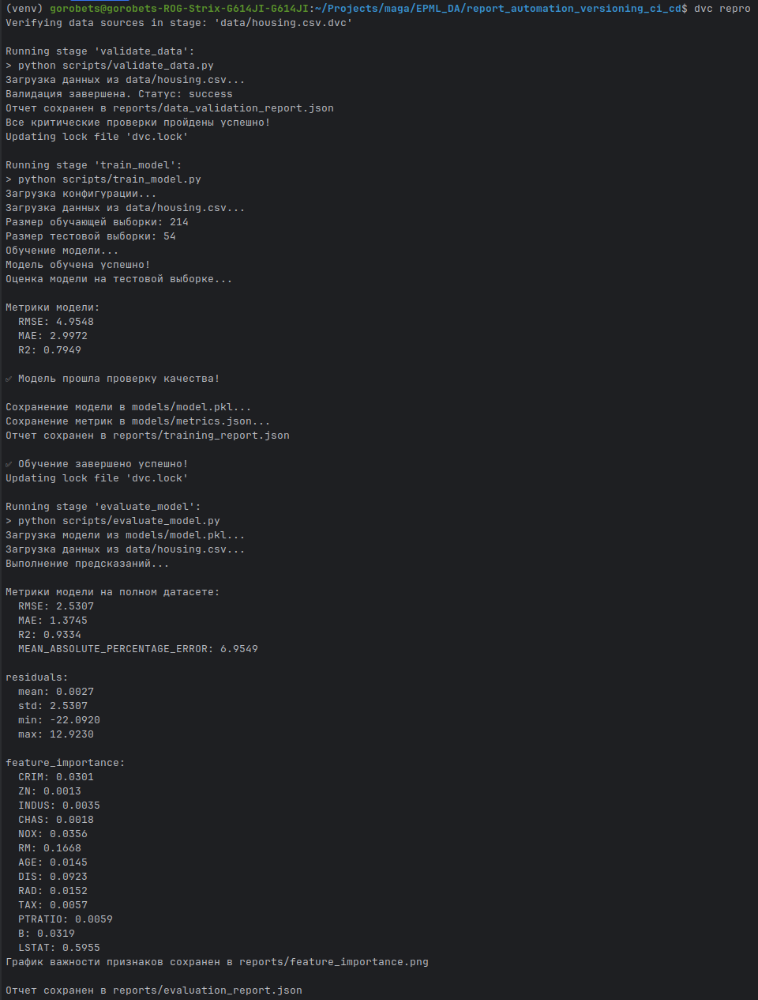

---

## 3. Проверки качества

### 3.1. Скрипты валидации данных

- **Задача:** формализовать требования к данным и сделать их воспроизводимыми.

**В проекте:**

- используется `scripts/validate_data.py`,
- формирует отчёт `reports/data_validation_report.json`,
- при критических ошибках (формат, пропуски, типы) завершает процесс с ошибкой.

---

### 3.2. Проверки качества модели

- **Задача:** убедиться, что новая версия модели не хуже заданных порогов.

**В проекте:**

- пороги заданы в `params.yaml` (`thresholds.min_r2`, `thresholds.max_rmse`),
- `scripts/train_model.py` после обучения:
  - считает метрики,
  - сравнивает их с порогами,
  - при провале завершает работу с кодом 1.

---

### 3.3. Тесты на воспроизводимость (как сделано здесь)

В проекте уже есть файл `tests/test_model_reproducibility.py`, который:

- дважды запускает `python scripts/train_model.py` в одном и том же окружении,
- после каждого запуска читает `models/metrics.json`,
- сравнивает `r2`, `rmse`, `mae` с очень маленькой допустимой разницей (`< 0.0001`).

**Как, почему и зачем:**

- **Как:** используется фиксированный `random_state` из конфигурации, поэтому при неизменных данных и коде метрики должны совпадать.
- **Почему:** это проверяет, что эксперимент воспроизводим, а изменения в коде/конфиге не вносят скрытую недетерминированность.
- **Зачем:** в CI этот тест можно запускать через `pytest`, и при нарушении воспроизводимости пайплайн будет падать.

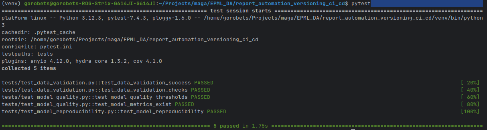

---

### 3.4. Проверки производительности

- **Задача:** контролировать время обучения и/или время ответа модели.

В текущем проекте фокус на качестве и воспроизводимости, но можно дополнить:

- замером времени обучения в `scripts/train_model.py`,
- замером времени предсказания на фиксированном числе примеров в `scripts/evaluate_model.py`,
- добавлением порогов по времени в `params.yaml`.

---

## 4. Интеграция с Git (как это работает для версий в этом проекте)

### 4.1. Как отследить, какие данные и модель использовались в конкретном эксперименте

В этом проекте **эксперимент = Git‑коммит + соответствующий `dvc.lock`**.

- **Как:** после запуска `dvc repro` (или отдельных стадий) вы:
  1. получаете обновлённые `dvc.lock`, `models/model.pkl`, отчёты в `reports/`,
  2. фиксируете эксперимент:
     ```bash
     git add dvc.lock reports/ models/
     git commit -m "Experiment: new params, RMSE=..."
     dvc push
     git push
     ```
- **Почему:** в `dvc.lock` записаны хэши:
  - `data/housing.csv` (конкретная версия данных),
  - `models/model.pkl` (конкретная версия модели),
  - команды и параметры всех стадий (`validate_data`, `train_model`, `evaluate_model`).
- **Зачем:** по одному Git‑коммиту можно однозначно понять:
  - какие данные использовались,
  - какая модель была обучена,
  - какие метрики и отчёты к этому эксперименту относятся.

**Практический сценарий:**

1. Находите нужный эксперимент:
   ```bash
   git log --oneline
   ```
2. Переключаетесь на него:
   ```bash
   git checkout <commit_hash>
   dvc pull   # восстановит нужные версии данных и модели
   ```
3. Смотрите:
   - `models/metrics.json` и `reports/*.json` — метрики и отчёты,
   - `reports/feature_importance.png` — важность признаков.

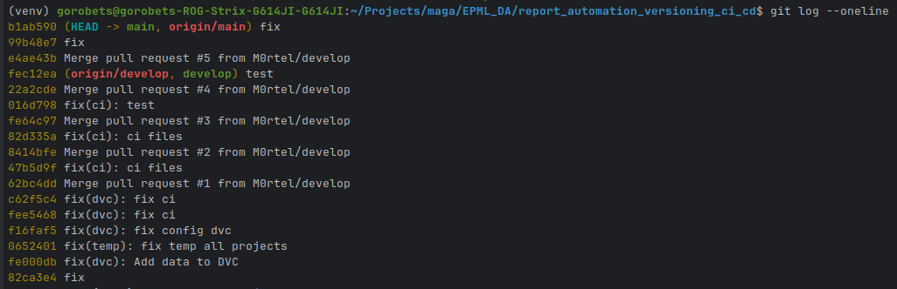

---

### 4.2. Как вернуться к прошлой версии (откатиться по данным и модели)

Чтобы вернуться к прошлой версии данных и модели:

1. Выберите нужный коммит (или тег):
   ```bash
   git checkout <старый_commit_или_tag>
   ```
2. Восстановите данные и модель для этой версии:
   ```bash
   dvc pull
   # при необходимости:
   # dvc checkout
   ```

После этого:

- `data/housing.csv` — **та самая версия данных**, с которой работал тот эксперимент,
- `models/model.pkl` — **та самая модель**, обученная в этом эксперименте,
- отчёты в `reports/` соответствуют именно этой связке код + данные + параметры.

**Почему это работает:**  
DVC хранит содержимое файлов в кэше/remote, а `dvc.lock` связывает конкретные версии файлов с Git‑коммитом. Git отвечает за историю метаданных (`dvc.yaml`, `dvc.lock`, код), DVC — за физическое содержимое данных и моделей.

---

### 4.3. Теги для удобного именования версий (опционально)

Для удобства можно помечать удачные эксперименты тегами:

- **Как:**
  ```bash
  git tag -a v1.0 -m "Model v1.0, RMSE=..."
  git push origin v1.0
  ```
- **Почему:** проще обсуждать “модель v1.0” или “эксперимент v2.1”, чем ссылаться на хэши коммитов.
- **Зачем:** в докладе можно показать эволюцию моделей: `v1.0` → `v1.1` → `v2.0` (и привязать к ним метрики и конфигурации).

**Скриншот 15:** список тегов (`git tag`) и страница релиза в GitHub (если оформляете релизы).  
_(вставьте сюда скриншот)_

---

## 5. Что показать в итоговом докладе

### 5.1. CI‑workflow с этапами

- Схема/диаграмма пайплайна:
  - получение кода из GitHub,
  - `dvc pull` (данные и модели),
  - `dvc repro` или последовательный запуск стадий:
    - `validate_data`,
    - `train_model`,
    - `evaluate_model`,
  - запуск тестов (`pytest`),
  - (опционально) деплой / публикация артефактов.

**Скриншот 16:** визуальное представление пайплайна (диаграмма или скриншот интерфейса GitHub Actions).  
_(вставьте сюда скриншот)_

---

### 5.2. Автоматическое создание версий в DVC

- Показать:
  - как меняется `dvc.lock` при новых экспериментах (разные хэши данных и модели),
  - как по `dvc.lock` и `git log` можно понять разницу между версиями,
  - как с помощью `git checkout` + `dvc pull` вернуться к прошлой версии данных и модели.

**Скриншот 17:** сравнение двух версий `dvc.lock` между коммитами (diff в IDE или GitHub).  
_(вставьте сюда скриншот)_

---

### 5.3. Проверки качества данных и моделей

- Показать:
  - отчёт валидации данных (`reports/data_validation_report.json`),
  - метрики качества модели (`models/metrics.json`, `reports/training_report.json`, `reports/evaluation_report.json`),
  - результат тестов на воспроизводимость (`tests/test_model_reproducibility.py`),
  - (опционально) проверки производительности.

**Скриншот 18:** итоговый отчёт/страница CI‑job, где собраны основные метрики и статусы проверок.  
_(вставьте сюда скриншот)_

---

## 6. Рекомендуемая структура презентации

1. **Постановка задачи:** зачем нужно версионирование данных и моделей в ML‑проектах.
2. **Инструменты:** Git, DVC, GitHub Actions, Python‑скрипты.
3. **Архитектура решения:** схема пайплайна (`dvc.yaml`) и связей между компонентами.
4. **Демонстрация пайплайна:**
   - запуск CI при `push` / `pull_request`,
   - примеры логов (`validate_data`, `train_model`, `evaluate_model`),
   - результат тестов (`pytest`).
5. **Примеры версий:** на основе реальных коммитов/тегов этого проекта показать,
   - как по `git log` и `dvc.lock` понять, какие данные и модель использовались в конкретном эксперименте,
   - как с помощью `git checkout` + `dvc pull` вернуться к прошлой версии данных и модели.
6. **Выводы:** преимущества автоматизации версионирования (воспроизводимость, контроль качества, прозрачность экспериментов, удобное сравнение экспериментов).

В результате выполнения работы вы получаете рабочий CI/CD‑пайплайн, который:

- автоматически подтягивает версии данных и моделей из DVC,
- валидирует данные,
- обучает и оценивает модель,
- фиксирует новые версии в DVC и Git,
- позволяет отследить, какие данные и модель использовались в любом эксперименте,
- даёт возможность легко откатиться к прошлой версии и сравнить результаты.


